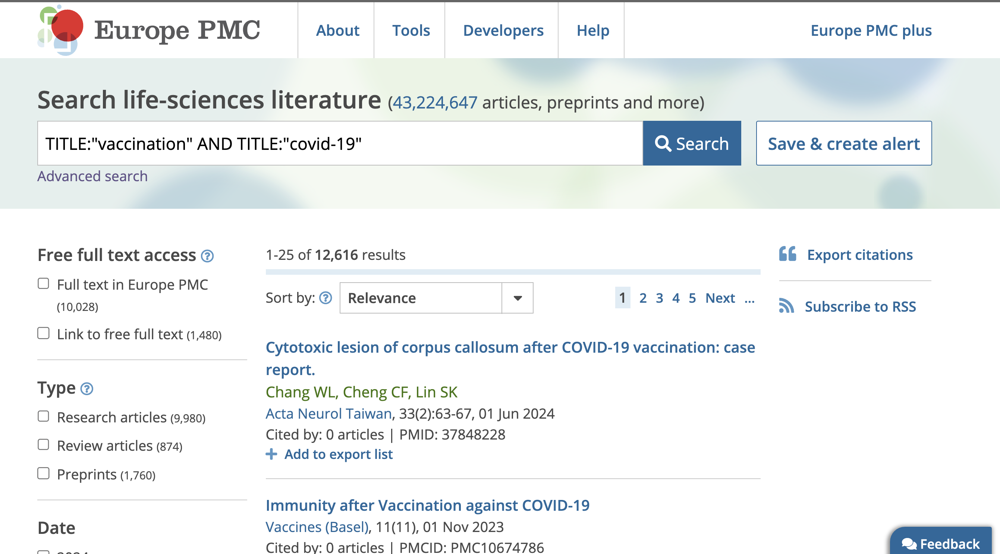

## Motivation

It is common to want to extract data from an online database, extract information from a web page, or interact with a web application. 
Doing so requires an understanding of:

1. How the web works and how to interact with it.
2. How computers represent the data when it is transmitted over the web.
3. How to parse the data into a format that can be used by a computer.
4. How to extract the information that you want from the data.
5. How to use the extracted information in your own application.
6. How to automate the process of extracting the information.

## How does the web work?

The Web (or World Wide Web, as it was originally called), works by using a client-server model. 
A client (usually a web browser) sends a request to a server (most often a web server like Apache, Nginx, IIS, Tomcat, etc.)
The server then sends a response back to the client.
The response contains the requested content, or an error message if an error occurred.
The content of the response is usually HTML, but it can also be JSON, XML, or some other format.

```{mermaid}
%%| fig-cap: The interaction between a user, a client, and a server.
%%| label: fig-sequence-diagram

sequenceDiagram
    autonumber
    participant User
    participant Client
    participant Server
    User->>Client: URL in browser
    Client->>Server: Request
    Server->>Client: Response
    Client->>User: HTML page
    User->>Client: Specify search terms and click search button
    Client->>Server: Request
    Server->>Client: Response
    Client->>User: HTML page
```

@fig-sequence-diagram shows a sequence diagram of the interaction between a user, a client, and a server. 
Let's walk through the steps on the sequence diagram by navigating to the European PMC website <https://europepmc.org/> (see @fig-europepmc, point 1). 
The browser sends a request to the server (see @fig-europepmc, point 2).
The server then sends a response back to the browser (see @fig-europepmc, point 3).
The response contains the requested content, or an error message if an error occurred.
In this case, the response is an HTML document that contains the content of the website (see @fig-europepmc, point 4).


{#fig-europepmc}

Let's do a search for studies related to COVID-19 vaccinations. 
This isn't hard, but it does require a little trickery to ensure that the search is interpreted correctly by the server.
Paste the following into the search box and click the search button (see @fig-europepmc, point 5).

```
TITLE:"vaccination" AND TITLE:"covid-19"
```

The browser sends a request to the server (see @fig-europepmc, point 6).
The server then does the search and sends a response back to the browser (see @fig-europepmc, point 7).
Finally, the browser displays the search results (see @fig-europepmc, point 8).

{#fig-europepmc-search}

We can also do some of the work of the browser by sending a request directly to the server.
In fact, you can paste that value into your browser to perform the search again without using the search box.
The server then sends a response back to the browser and the browser displays the search results.

Paste this into the browser address bar and hit enter:

```
https://europepmc.org/search?query=TITLE:%22vaccination%22+AND+TITLE:%22covid-19%22
```

HTML is a markup language that is used to structure content on the web and is the most common format for transmitting data between a server and a web application.
However the resulting "page" is not very useful for a computer. 
If we wanted to use a computer to understand this response (e.g., to extract the number of results), we would need to write code to parse the HTML, which looks like this:

```{html}

<!DOCTYPE html>
<html lang="en" prefix="dc: http://purl.org/dc/elements/1.1/#; dcterms: http://purl.org/dc/terms/#">
<head><meta http-equiv="X-UA-Compatible" content="IE=edge"><meta charset="utf-8"><meta name="viewport" content="width=device-width"><script type="text/javascript" src="./wicket/resource/org.apache.wicket.resource.JQueryResourceReference/jquery/jquery-1.11.1.min-ver-8101D596B2B8FA35FE3A634EA342D7C3.js"></script>
<link rel="stylesheet" type="text/css" href="/css_min/min/orcid-min.css?v=1210" />
<script type="text/javascript" src="./wicket/resource/org.europepmc.account.AccountSigninPanel/AccoutSigninPanel-ver-23536C62407C81CFCDCB80EBF689D4C9.js"></script>
<script type="text/javascript" src="./wicket/resource/org.apache.wicket.ajax.AbstractDefaultAjaxBehavior/res/js/wicket-event-jquery.min-ver-F070EDFAD7E5A1BD9662F385470094FF.js"></script>
<script type="text/javascript" src="./wicket/resource/org.apache.wicket.ajax.AbstractDefaultAjaxBehavior/res/js/wicket-ajax-jquery.min-ver-1D4EE56166B3A1106E05B678CC2AB1EF.js"></script>
<script type="text/javascript" src="./wicket/resource/org.apache.wicket.extensions.ajax.markup.html.modal.ModalWindow/res/modal.min-ver-E43C9229F7812A6259B89C7E5B5028FB.js"></script>
<link rel="stylesheet" type="text/css" href="./wicket/resource/org.apache.wicket.extensions.ajax.markup.html.modal.ModalWindow/res/modal.min-ver-E99D4201F0F6C5D3081AD42ACB1F22C2.css" />
<script type="text/javascript" id="wicket-ajax-base-url">
/*<![CDATA[*/
Wicket.Ajax.baseUrl="search?query=TITLE:%22nhanes%22+AND+TITLE:%22covid-19%22";
/*]]>*/
</script>

<style id="uk-bl-ukpmc-web-pages-template-TemplatePage-0">
/*<![CDATA[*/

#search-feature-link {
display: none;
}
@media only screen and (max-width: 800px) {
#search-feature-link {
display: block;
}
}

/*]]>*/
</style>
<script type="text/javascript" src="./wicket/resource/uk.bl.ukpmc.web.pages.template.TemplatePage/TemplatePage-ver-540ECA69167ECC178EB8C919D0809EB3.js"></script>

<title>Europe PMC</title>
<link rel="stylesheet" href="/template/font-awesome/css/all.min.css">
<link rel="stylesheet" href="/template/EPMC-iconfont/style.css?v=1210">
<link rel="icon" href="/images/favicon.ico" type="image/x-icon">
<link rel="alternate" type="application/rss+xml"
title="Europe PMC: Popular articles"
href="/Funders/RSS/MostViewedArticles.xml">
<link rel="alternate" type="application/rss+xml"
title="Europe PMC: Recent articles"
href="/Funders/RSS/AllFunders.xml">
<link rel="alternate" type="application/rss+xml"
title="Europe PMC: Latest journals"
href="/Funders/rss/NewJournals.xml">
<link rel="alternate" type="application/rss+xml"
title="Europe PMC: Content Holdings"
href="/contentrss">
<meta name="theme-color" content="#666"/>
<meta name="author" content="Europe PMC"/>
<meta name="owner" content="Europe PMC"/>
<meta name="keywords"
content="Europe PMC, Europe PubMed Central, open access, research articles, journal articles, abstracts, full text, literature search, clinical guidelines, biological patents, life sciences, bioinformatics, biomedical research, citation search, biomedical journals, ORCIDs, text mining, citation networks, REST APIs "/>
<meta name="description" content="Europe PMC is an archive of life sciences journal literature."/>
<meta http-equiv="X-UA-Compatible" content="IE=11" />

<link rel="search" type="application/opensearchdescription+xml" title="Search Europe PMC" href="/tools_epmc/opensearch_epmc.xml">
<link rel="stylesheet" type="text/css" media="print, screen" href="/template/jquery_ui.css?v=1210"/>
<link rel="stylesheet" type="text/css" media="screen" href="/template/jquery_menu.css?v=1210"/>
<script type="text/javascript" src="/template/yahoo-min.js?v=1210"></script>
<script type="text/javascript" src="/template/dom-min.js?v=1210"></script>
<script type="text/javascript" src="/template/enrichment.js?v=1210"></script>
<link rel="stylesheet" type="text/css" media="print, screen" href="/template/enrichment.css?v=1210"/>
<script type="text/javascript" src="/template/hoverIntent.js?v=1210"></script>
<script type="text/javascript" src="/template/jquery.js?v=1210"></script>
<link rel="stylesheet" type="text/css" href="/template/ncbi/epmc.ncbi.css?v=1210"/>
<script type="text/javascript" src="/template/epmc.js?v=1210"></script>
<link rel="stylesheet" type="text/css" href="/template/epmc_new.css?v=1210"/>

```


## Introduction to JSON

Our next step in understanding how to extract data from the web is to understand how computers represent the data when it is transmitted over the web.

JSON, which is an abbreviation for Javascript Object Notation is a lightweight data interchange format that is easy for humans to read and write and easy for machines to parse and generate.
It is often used to transmit data between a server and a web application.
JSON was first specified by Douglas Crockford in the early 2000s.
It emerged as a response to the need for a simpler, more lightweight data interchange format compared to XML or HTML.

JSON is commonly used for data interchange between a server and a web application.
It's a popular format for representing configuration data and transmitting data between a server and a client, especially when the client is a computer program.
JSON is also used for serializing and transmitting structured data over a network connection.


### Structure of JSON

JSON data is represented as key-value pairs, similar to a dictionary in Python, a list in R, or an object in JavaScript.
Data is written as name/value pairs, where the name (a string) is followed by a colon, and the value can be a string, number, object, array, boolean, or null.

```{json}
{
  "name": "John Doe",
  "age": 30,
  "city": "New York",
  "isStudent": false,
  "grades": [90, 85, 92]
}
```

JSON supports nested structures, allowing for the representation of hierarchical and complex data.

```{json}
{
  "person": {
    "name": "Alice",
    "age": 25,
    "address": {
      "street": "123 Main St",
      "city": "Cityville",
      "zip": "12345"
    }
  },
  "isStudent": true
}
```


### JSON and web APIs

Web APIs are a common way to interact with a web application. 
These APIs allow you to interact with a web application using a programming language like Python or R.
Web APIs are often used to extract data from a web application, such as a database like Europe PMC.

Let's look at the same example we used above, but this time we will use the Europe PMC web API to extract the data.

::: {.callout-note}

The Europe PMC web API is documented at <https://europepmc.org/RestfulWebService>.
The documentation provides examples of how to use the API to extract data from Europe PMC.
For example, the Search API is documented at <https://europepmc.org/RestfulWebService#!/Europe32PMC32Articles32RESTful32API/search>.

:::

The Europe PMC web API is a RESTful API, which means that it uses the HTTP protocol to send and receive data.
The HTTP protocol is the same protocol that is used by web browsers to communicate with web servers.
The HTTP protocol is a request-response protocol, which means that a client sends a request to a server and the server sends a response back to the client.

Let's use the Europe PMC web API to extract the number of results for the search for "vaccination" and "covid-19" and the first three results.

The URL for this search using the Europe PMC web API is:

<https://www.ebi.ac.uk/europepmc/webservices/rest/search?query=TITLE:%22vaccination%22+AND+TITLE:%22covid-19%22&format=json&pageSize=3>

::: {.callout-tip}

JSON can be challenging to read and understand without formatting that renders the JSON more human-readable. 
When viewing JSON in a browser, the [JSONVue](https://chromewebstore.google.com/detail/jsonvue/chklaanhfefbnpoihckbnefhakgolnmc?hl=en-US&utm_source=ext_sidebar) extension for Chrome can be used to format JSON in the browser.
You can also use the [JSON Formatter](https://jsonformatter.org/) website to format JSON by cutting and pasting the JSON into the website. 

:::

Either install a JSON formatter extension for your browser or go to <https://jsonformatter.org/> and paste the results from your web browser into the website.

## Working with JSON in R

The next steps in working with JSON from the web involve using a different _client_ than a web browser.
In this case, we will use R as our client.

R has a number of packages that can be used to work with JSON, but we will focus on the `jsonlite` package. 

First, we need to install the package.

```{r eval=FALSE}
install.packages("jsonlite")
```

The `jsonlite` package provides a number of functions for working with JSON, but we will focus on the `fromJSON()` function, which converts JSON to an R object.

```{r}
library(jsonlite)
URL <- "https://www.ebi.ac.uk/europepmc/webservices/rest/search?query=TITLE:%22vaccination%22+AND+TITLE:%22covid-19%22&format=json&pageSize=3"
r_result <- jsonlite::fromJSON(URL)
class(r_result)
```

The `fromJSON()` function returns a list, which is a common data structure in R.
Let's look at the structure of the list in R. 

```{r}
str(r_result)
```

- Compare the structure of the list in R to the structure of the JSON in the browser. 
- Compare the number of results in the JSON to the number of results in the R list.
- Compare the number of results in the R list to the number of results in the browser.

We can access individual elements of the list using the `$` operator.

```{r}
r_result$hitCount
```

And we can do the same for "nested" elements of the list.

```{r}
r_result$request$queryString
```

Note that the "important" information comes into R as a data.frame, but it is "nested" inside the list.
Let's pull it out of the list and assign it to a variable.

```{r}
top3_articles <- r_result$resultList$result
```

Let's not stop with the top 3 articles and instead get the top 1000 articles.
To do so, we simply change our URL to request 1000 results.

```{r}
URL <- "https://www.ebi.ac.uk/europepmc/webservices/rest/search?query=TITLE:%22vaccination%22+AND+TITLE:%22covid-19%22&format=json&pageSize=1000"
r_result <- jsonlite::fromJSON(URL)
top1000_articles <- r_result$resultList$result
```

And now we can plot the number of articles by year.

```{r}
library(ggplot2)
ggplot(top1000_articles, aes(x = pubYear)) +
  geom_bar()
```

## Don't stop there!

We can also use the new large language models like ChatGPT to generate JSON structured data from text. 
Why would we want to do this? 
Well, it's a way to automate the process of extracting information from text. 
Imagine a scenario where you have a large number of documents that you want to extract information from.
You could use ChatGPT to automate the process of extracting the information from the documents and then read the JSON to get the information you want.


I supplied the following to ChatGPT, taken from the NHANES website <https://www.cdc.gov/nchs/nhanes/about_nhanes.htm>:

```
I'd like to structure the data in this document as JSON. Can you do so for me? 

As in past health examination surveys, data will be collected on the prevalence of chronic conditions in the population. Estimates for previously undiagnosed conditions, as well as those known to and reported by respondents, are produced through the survey. Such information is a particular strength of the NHANES program.

Risk factors, those aspects of a person’s lifestyle, constitution, heredity, or environment that may increase the chances of developing a certain disease or condition, will be examined. Smoking, alcohol consumption, sexual practices, drug use, physical fitness and activity, weight, and dietary intake will be studied. Data on certain aspects of reproductive health, such as use of oral contraceptives and breastfeeding practices, will also be collected.

The diseases, medical conditions, and health indicators to be studied include:

Anemia
Cardiovascular disease
Diabetes
Environmental exposures
Eye diseases
Hearing loss
Infectious diseases
Kidney disease
Nutrition
Obesity
Oral health
Osteoporosis
Physical fitness and physical functioning
Reproductive history and sexual behavior
Respiratory disease (asthma, chronic bronchitis, emphysema)
Sexually transmitted diseases
Vision
The sample for the survey is selected to represent the U.S. population of all ages. To produce reliable statistics, NHANES over-samples persons 60 and older, African Americans, and Hispanics.

Since the United States has experienced dramatic growth in the number of older people during this century, the aging population has major implications for health care needs, public policy, and research priorities. NCHS is working with public health agencies to increase the knowledge of the health status of older Americans. NHANES has a primary role in this endeavor.

All participants visit the physician. Dietary interviews and body measurements are included for everyone. All but the very young have a blood sample taken and will have a dental screening. Depending upon the age of the participant, the rest of the examination includes tests and procedures to assess the various aspects of health listed above. In general, the older the individual, the more extensive the examination.
```

ChatGPT gave back to me the following:

```json
{
  "surveyDetails": {
    "purpose": "Data collection on the prevalence of chronic conditions in the population",
    "strength": "Information on undiagnosed and diagnosed chronic conditions",
    "program": "NHANES (National Health and Nutrition Examination Survey)"
  },
  "riskFactors": {
    "categories": [
      "Smoking",
      "Alcohol consumption",
      "Sexual practices",
      "Drug use",
      "Physical fitness and activity",
      "Weight",
      "Dietary intake",
      "Reproductive health (e.g., oral contraceptives, breastfeeding)"
    ]
  },
  "healthTopics": {
    "toStudy": [
      "Anemia",
      "Cardiovascular disease",
      "Diabetes",
      "Environmental exposures",
      "Eye diseases",
      "Hearing loss",
      "Infectious diseases",
      "Kidney disease",
      "Nutrition",
      "Obesity",
      "Oral health",
      "Osteoporosis",
      "Physical fitness and physical functioning",
      "Reproductive history and sexual behavior",
      "Respiratory disease (asthma, chronic bronchitis, emphysema)",
      "Sexually transmitted diseases",
      "Vision"
    ]
  },
  "sampleSelection": {
    "representativeOf": "U.S. population of all ages",
    "oversampling": [
      "Persons 60 and older",
      "African Americans",
      "Hispanics"
    ]
  },
  "implications": {
    "agingPopulation": {
      "impact": "Major implications for health care needs, public policy, and research priorities",
      "focus": "NCHS (National Center for Health Statistics) working to increase knowledge of health status of older Americans",
      "role": "NHANES has a primary role in this endeavor"
    }
  },
  "participantDetails": {
    "commonActivities": [
      "Visit to physician",
      "Dietary interviews",
      "Body measurements"
    ],
    "commonTests": [
      "Blood sample (for all but the very young)",
      "Dental screening"
    ],
    "ageDependentTests": "Tests and procedures to assess various aspects of health, with the extent increasing with age"
  }
}
```


## Conclusion

In this lesson, we learned about how the web works, how computers represent the data when it is transmitted over the web, how to parse the data into a format that can be used by a computer, how to extract the information that you want from the data, how to use the extracted information in your own application, and how to automate the process of extracting the information.

## References

- <https://cran.r-project.org/web/packages/jsonlite/vignettes/json-aaquickstart.html>
- 
